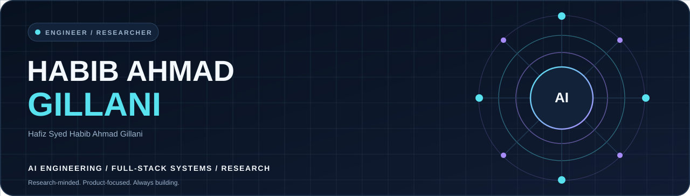
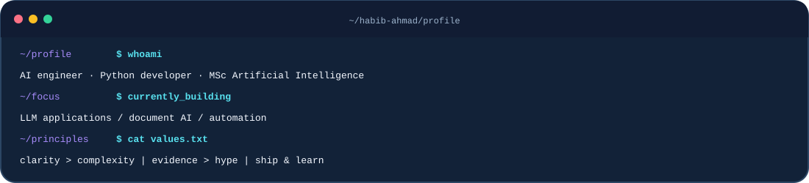
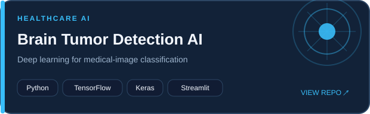
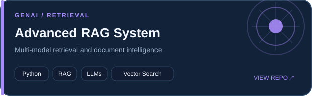
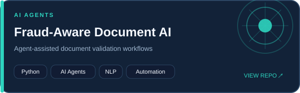
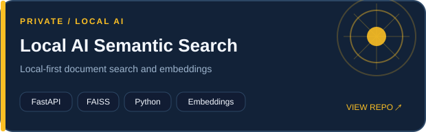
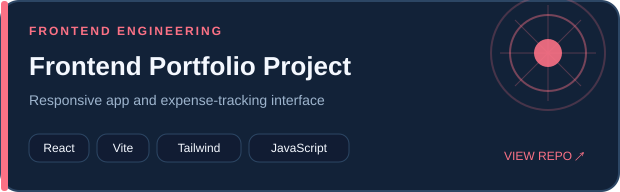
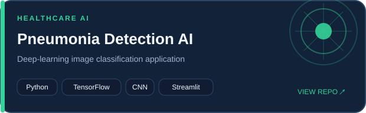
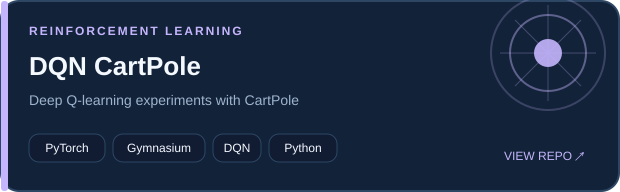
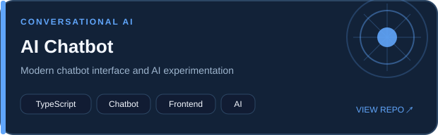

<!-- Premium GitHub Profile | Generated from config/profile.json -->

<picture><source media="(prefers-color-scheme: dark)" srcset="assets/hero-dark.svg"/><source media="(prefers-color-scheme: light)" srcset="assets/hero-light.svg"/></picture>

  

## 01 / About

I'm a **Computer Science graduate from UET Lahore**, currently pursuing an **MSc in Artificial Intelligence**. I build practical AI-powered software spanning **retrieval systems, computer vision, intelligent automation, and full-stack applications**.

<table><tr><td width="50%" valign="top">

**Currently exploring**

- Generative AI, RAG and LLM applications
- Agentic AI and automation
- Computer vision and deep learning
- Reliable Python services and APIs

</td><td width="50%" valign="top">

**Engineering principles**

- Useful products over empty demos
- Clear interfaces and maintainable code
- Research-minded experimentation
- Open collaboration and continuous learning

</td></tr></table>

## 02 / Developer console

<picture><source media="(prefers-color-scheme: dark)" srcset="assets/terminal-dark.svg"/><source media="(prefers-color-scheme: light)" srcset="assets/terminal-light.svg"/></picture>

## 03 / Technology toolkit

**Languages**

**AI and data**

**Full-stack**

**Databases and developer tools**

Also: SQL · FAISS · REST APIs · NLP · Jupyter · Matplotlib · Vector search

## 04 / Featured engineering work

Selected repositories. Click a card to explore source code.

<table><tr>
<td width="50%" valign="top"><a href="https://github.com/syedhabibahmadg/-Brain-Tumor-Detection-AI-Deep-Learning-Medical-Image-Classifier"><picture><source media="(prefers-color-scheme: dark)" srcset="assets/projects/brain-tumor-dark.svg"/><source media="(prefers-color-scheme: light)" srcset="assets/projects/brain-tumor-light.svg"/></picture></a> Python · TensorFlow · Keras · Streamlit</td>
<td width="50%" valign="top"><a href="https://github.com/syedhabibahmadg/Advanced-RAG-System-with-Multi-Model-Support"><picture><source media="(prefers-color-scheme: dark)" srcset="assets/projects/advanced-rag-dark.svg"/><source media="(prefers-color-scheme: light)" srcset="assets/projects/advanced-rag-light.svg"/></picture></a> Python · RAG · LLMs · Vector Search</td>
</tr></table>

<table><tr>
<td width="50%" valign="top"><a href="https://github.com/syedhabibahmadg/Fraud-Aware-Docs-Intelligent-System"><picture><source media="(prefers-color-scheme: dark)" srcset="assets/projects/fraud-docs-dark.svg"/><source media="(prefers-color-scheme: light)" srcset="assets/projects/fraud-docs-light.svg"/></picture></a> Python · AI Agents · NLP · Automation</td>
<td width="50%" valign="top"><a href="https://github.com/syedhabibahmadg/Local-AI-Document-Processing-Semantic-Search-System"><picture><source media="(prefers-color-scheme: dark)" srcset="assets/projects/semantic-search-dark.svg"/><source media="(prefers-color-scheme: light)" srcset="assets/projects/semantic-search-light.svg"/></picture></a> FastAPI · FAISS · Python · Embeddings</td>
</tr></table>

<table><tr>
<td width="50%" valign="top"><a href="https://github.com/syedhabibahmadg/B0626---Hafiz-Syed-Habib-Ahmad-Gillani---Innovaxel---Frontend-Developer"><picture><source media="(prefers-color-scheme: dark)" srcset="assets/projects/frontend-dark.svg"/><source media="(prefers-color-scheme: light)" srcset="assets/projects/frontend-light.svg"/></picture></a> React · Vite · Tailwind · JavaScript</td>
<td width="50%" valign="top"><a href="https://github.com/syedhabibahmadg/Chest-Pneumonia-detection-system-with-model-and-Frontend"><picture><source media="(prefers-color-scheme: dark)" srcset="assets/projects/pneumonia-dark.svg"/><source media="(prefers-color-scheme: light)" srcset="assets/projects/pneumonia-light.svg"/></picture></a> Python · TensorFlow · CNN · Streamlit</td>
</tr></table>

<table><tr>
<td width="50%" valign="top"><a href="https://github.com/syedhabibahmadg/dqn-cartpole-pytorch"><picture><source media="(prefers-color-scheme: dark)" srcset="assets/projects/dqn-cartpole-dark.svg"/><source media="(prefers-color-scheme: light)" srcset="assets/projects/dqn-cartpole-light.svg"/></picture></a> PyTorch · Gymnasium · DQN · Python</td>
<td width="50%" valign="top"><a href="https://github.com/syedhabibahmadg/chatbot-ai"><picture><source media="(prefers-color-scheme: dark)" srcset="assets/projects/ai-chatbot-dark.svg"/><source media="(prefers-color-scheme: light)" srcset="assets/projects/ai-chatbot-light.svg"/></picture></a> TypeScript · Chatbot · Frontend · AI</td>
</tr></table>

## 05 / GitHub activity

 

### Contribution snake

<picture>
<source media="(prefers-color-scheme: dark)" srcset="https://raw.githubusercontent.com/syedhabibahmadg/syedhabibahmadg/output/github-contribution-grid-snake-dark.svg"/>
<source media="(prefers-color-scheme: light)" srcset="https://raw.githubusercontent.com/syedhabibahmadg/syedhabibahmadg/output/github-contribution-grid-snake.svg"/>

</picture>

> GitHub stats are third-party images and may occasionally be rate-limited. The snake appears after the first successful workflow run.

## 06 / Education

| Program | Institution | Status |
|:--|:--|:--|
| MSc Artificial Intelligence | University of Engineering and Technology (UET), Lahore | In progress |
| BSc Computer Science | University of Engineering and Technology (UET), Lahore | Completed |

## 07 / Collaborate

Interested in **AI/ML research**, **intelligent automation**, **full-stack development**, and **open-source collaboration**. Explore my repositories or reach out via email.

Designed with care · Self-hosted profile artwork · Automatically refreshed contribution animation

